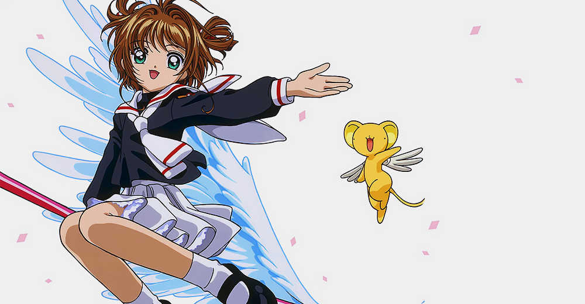
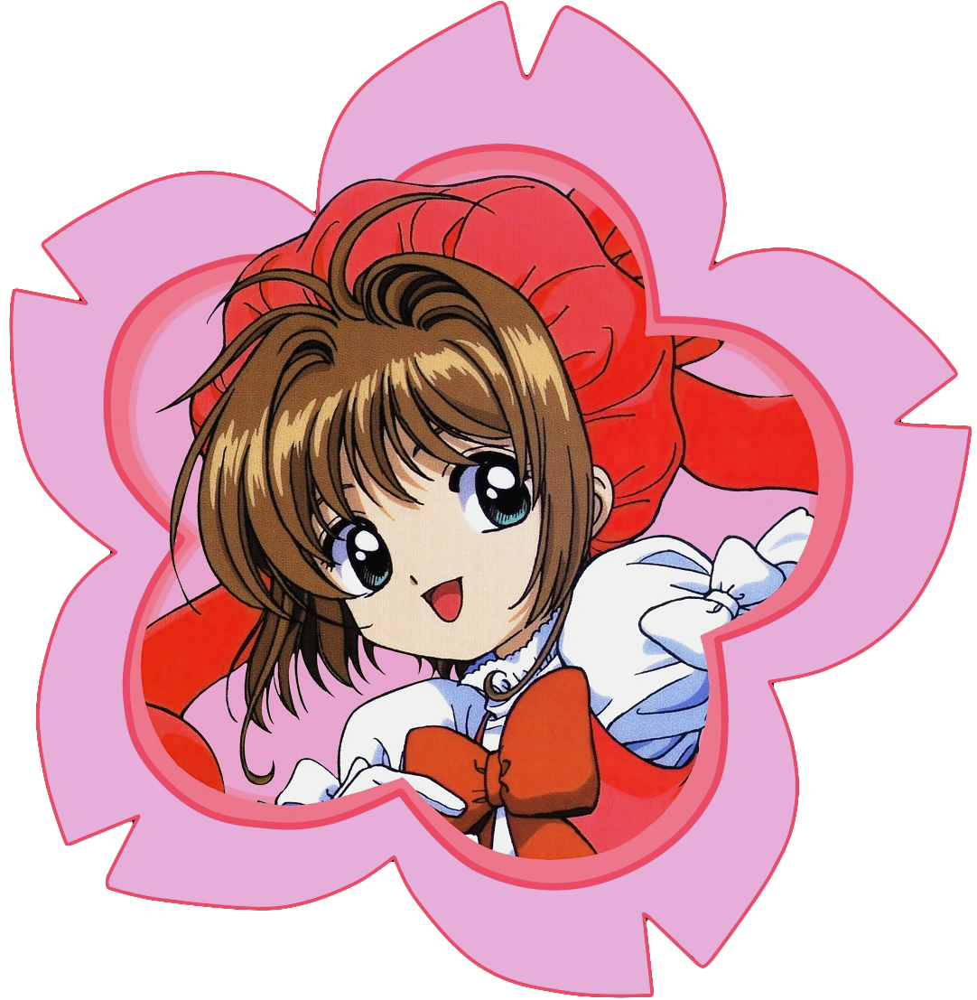

<div align="center">
  <h1>Cardcaptor Sakura API 🌸</h1>
  
  A simple RESTful API for Cardcaptor Sakura cards - [cardcaptorsakura.live](https://cardcaptorsakura.live/)

<br/><br/>

| HTTP Method |     Endpoint     |   Returns   |
| :---------: | :--------------: | :---------: |
|     GET     |  api/cards/all   |  all cards  |
|     GET     | api/cards/random | random card |

<br/><br/>

</div>

Currently supported query string parameters:

| Parameter | Description                                 |
| --------- | ------------------------------------------- |
| page      | Returns a paginated set.                    |
| limit     | The maximum amount of cards to be returned. |

<br/>

Example:

```bash

📃  First page showing 10 cards
https://cardcaptorsakura.live/api/cards?page=1&limit=10
```

## JSON Data Model Example

```json
{
  "_id": "63ddd037100f141605dac4cf",
  "name": "The Arrow",
  "kanji": "矢",
  "katakana": "アロー",
  "clowCardUrl": "https://static.wikia.nocookie.net/ccs/Images/8/80/ClowArrow.jpg/revision/latest?cb=20220525093411",
  "sakuraCardUrl": "https://static.wikia.nocookie.net/ccs/Images/a/a9/SakuraArrow.jpg/revision/latest?cb=20160527122905",
  "sign": "Sun",
  "hierarchy": "The Firey",
  "magicType": "Western Magic",
  "temperament": "Aggressive",
  "appearance": "Arrow is a smallish, white girl, wearing a bluish-purple outfit consisting of shorts, a top with long, coattails, long gloves, knee-high stockings, and shoes topped with a ball on each foot. A pudding basin haircut, a red, circular gem on her forehead over her hair, and two, long pigtails held by balls. Arrow carries a short, blue bow.",
  "personality": "The Arrow is an attack card with an aggressive temperament.",
  "abilities": {
    "Archery Magic": "When Arrow is activated, she appears and fires a volley of arrows at her master's command.",
    "Fortune Telling": "All Clow Cards have the ability to help their user predict the future. Their method of fortune-telling is similar to that of tarot cards. The interpretation of the message the Clow Cards relay depends on the magical power of the user."
  },
  "trivia": ["The Arrow's transformation is not shown in the series."],
  "createdAt": "2023-02-04T03:25:43.989Z",
  "updatedAt": "2023-02-04T03:25:43.989Z",
  "__v": 0
}
```

<br/>

## Reference

`_id`: Card id. <br>
`name`: Card name in English<br>
`kanji`: Card name in Kanji<br>
`katakana`: Card name in Katakana<br>
`clowCardUrl`: Image url of the card (Clow version)<br>
`sakuraCardUrl`: Image url of the card (Sakura version)<br>
`sign`: Card's magic sign<br>
`hierarchy` : Guardian of the Clow, the power used to create the card<br>
`magicType`: Card's magic type<br>
`temperament`: Card's temperament<br>
`appearance`: Appearence of the card's incarnation<br>
`personality`: Card's personality<br>
`abilities`: Abilities and magics the card can do<br>
`trivia`: Random facts about the card<br>

<br/>

## 🚀 Quick start

<div align="center">

<br/><br/>

|                                  |                                                       |
| :------------------------------: | ----------------------------------------------------: |
| npm install <br/><br/> npm start |  |
|                                  |                                                       |

<br/><br/>

</div>

### 🛠️ Built with

<br/>

<div align="center">


</div>

<br/>

### 🌸 Resources

- [Cardcaptor Sakura Wiki](https://cardcaptors.fandom.com/wiki/Cardcaptor_Sakura_Wiki)
